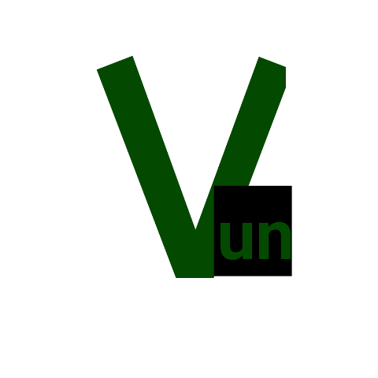

<h1>Vun</h1>
Vun is a high-level, lightweight, interpreted, statically-typed programming language. 
<h1> Build from source (cmake) </h1>
Run these commands: 
<code>git clone https://github.com/Vitalij3703/Vun.git</code> 
then 
<code>cd Vun</code> 
then 
<code>cmake -S . -B build/</code> 
in your terminal (errors may occur, if so report any to my email: v67010168@gmail.com, or fix them yourself.) 

  Note: DO NOT LEARN FROM THE testing_features FOLDER!!!!! MOST OF THESE ARE OUTDATED

